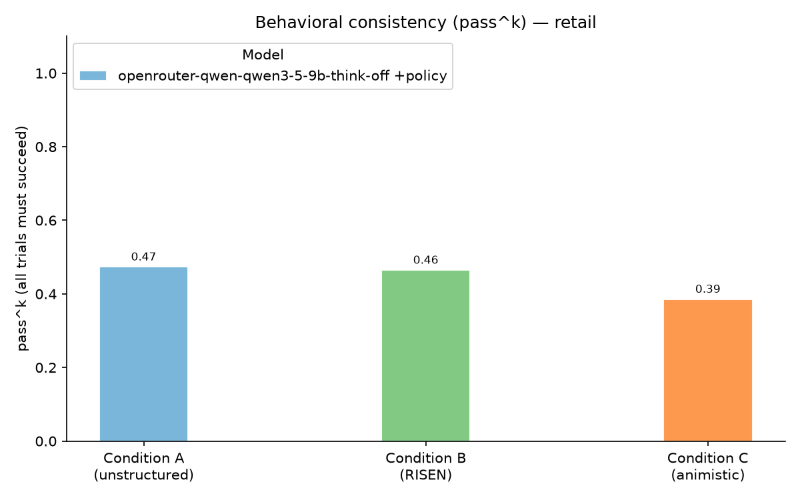

# Minimum Viable Test: Retail, k=5, Qwen3.5-9B

> **Status**: First k=5 result, run 2026-10-07. One model, one domain, framing prompts
> drafted by Claude and approved unedited. Design fixed in advance: see
> "Minimum Viable Test" in [PLAN.md](../PLAN.md).

## Short version

**No detectable benefit from artifact framing on success rates.** The three conditions
are within about one point on pass@1. On consistency (pass^5) the ledger trends *lower*,
though the confidence intervals include zero.

**But the framing changes how the agent fails.** The ledger makes fewer wrong writes and
more wrongful refusals (failing to act when it should). The two roughly cancel on pass@1,
and the occasional refusals pull down pass^5.

## Setup

| | |
|---|---|
| Conditions | A: unstructured role · B: RISEN · C: ledger (`prompts/retail/with-policy/`); each carries the verbatim τ²-bench retail policy |
| Domain | Retail, 114 tasks, τ²-bench v1.0.1 |
| Trials | k=5 (570 conversations per condition, 1,710 total) |
| Agent | Qwen3.5-9B via OpenRouter, pinned to DeepInfra (bf16), thinking off, temperature 0 |
| User simulator | DeepSeek V4 Pro via OpenRouter, pinned to StreamLake, temperature 0 |
| Infrastructure errors | 110 rate-limit failures in the first pass; all rerun with `--resume`, none remaining |
| Cost | $18.63 (agent + user simulator) |

## Results



| | A: role | B: RISEN | C: ledger |
|---|---|---|---|
| **pass@1** | 78.9% | 80.2% | 79.5% |
| **pass^5** (all 5 trials pass) | 47.4% | 46.5% | 38.6% |
| DB check (back of house) | 80.7% | 81.8% | 80.9% |
| NL assertions (front of house, 40 tasks) | 88.0% | 92.0% | 89.5% |
| Required info communicated (front of house, 36 tasks) | 90.6% | 96.1% | 95.6% |
| Read data before identity lookup | 3.3% | 1.6% | 2.6% |

Paired by task, with bootstrap 95% CIs over tasks ([mvt_comparisons.csv](mvt_comparisons.csv)):

| | pass@1 | pass^5 |
|---|---|---|
| C − A | +0.5 pts [−3.7, +4.7] | −8.8 pts [−19.3, +1.8] |
| C − B | −0.7 pts [−4.7, +3.3] | −7.9 pts [−17.5, +2.6] |
| B − A | +1.2 pts [−3.0, +5.6] | −0.9 pts [−11.4, +9.6] |

### Against the hypotheses

- **H1** (C ≥ B > A on policy adherence and pass^k): **not supported.** No difference on the DB check. pass^5 trends the other way.
- **H2** (A may match or beat C on raw completion): consistent. They match.
- **H5** (C better on back-of-house, worse on front-of-house measures): **not supported** by the planned measures. C matches A and B on the DB check, and matches B on communication. The failure analysis below suggests a related pattern the planned measures don't capture.

## How the failures differ

Each failed conversation's writes were compared with the task's expected writes
(`scripts/failures.py`):

| Failure group | A | B | C |
|---|---|---|---|
| **Under-action**: no write, transfer, or fewer writes than expected | 57 | 62 | **70** |
| **Wrong details**: right write tool, wrong arguments | 32 | 29 | **23** |
| **Wrong action**: extra or different writes | 21 | 13 | 16 |
| **Communication only**: DB right, an NL assertion failed | 10 | 9 | 8 |
| **Total failures** | 120 | 113 | 117 |

- **The ledger is more precise when it acts.** It has the fewest wrong-argument writes. Wrong payment method in particular: 1, against 4 (A) and 7 (B).
- **It more often fails to act.** Under-action failures with refusal language in the agent's last three messages: 33, against 28 (A) and 24 (B). Examples: "I cannot make exceptions to the refund policy", "You cannot exchange items from a pending order". Several are correct statements of the policy, applied where the task called for a write.
- **This is what the character sheet asks for.** "A false or impermissible entry is a defect in me" makes a ledger prefer not writing over writing wrong. Errors of commission become errors of omission.
- **It explains pass^5.** The refusals are sporadic, so the ledger passes many tasks 4 times out of 5. Tasks by number of passing trials:

  | Passing trials | 0 | 1 | 2 | 3 | 4 | 5 |
  |---|---|---|---|---|---|---|
  | A | 3 | 3 | 10 | 19 | 25 | 54 |
  | B | 2 | 4 | 9 | 14 | 32 | 53 |
  | C | 3 | 1 | 11 | 10 | **45** | 44 |

- **Task-level illustrations (5 trials each, so not evidence on their own).** C does better on precise single item changes (tasks 60 and 61: C passes 4–5 of 5, A and B 1–3) and on task 46. C does worse with messy or multi-step users: task 84 ("messy, flexible"), 104 ("one thing at a time", five writes), 59 (cancel and change address "in one go"), and 9.

This fits the [front/back of house](../PLAN.md#front-of-house-and-back-of-house) idea in spirit. The ledger is better at back-of-house precision and worse at handling an untidy conversation. The communication checks don't capture that, because they measure what was said, not how the conversation was managed.

### A benchmark artifact

24 failures happened because the **simulated user confirmed and ended the conversation in the
same message** ("Yes, let's do it! ###STOP###"), before the agent could write: 2 (A), 15 (B),
7 (C). This is user-simulator noise, not agent behavior, and it inflates B's under-action count.

## Caveats

- **Category differences are suggestive, not established.** For example, C's under-action share (60% of failures, against 48% for A) is borderline at roughly p≈0.06, and trials of one task are not independent. The labels come from an automatic classifier and pattern matching. Hand-code a sample before citing them.
- **The policy dominates the prompt.** It is about 1,150 words, against 210 words of framing. The result may mean "framing doesn't matter once the rules are spelled out".
- **One small model.** No manipulation check was run, so "the framing didn't take hold" cannot be ruled out in general. The failure-type shift does show it changed behavior.
- **Prompts drafted by Claude**, approved unedited by the researcher.

## Possible next steps

1. Hand-code ~30 failures per condition to confirm the commission/omission shift (also serves H4).
2. Rerun the paraphrase-only (spec-authoring) prompts at k=5, where the framing *is* the spec.
3. Repeat on a larger second model.
4. As a clearly labeled post-hoc follow-up: a ledger that also treats refusing a permitted entry as a defect.

## Reproducing

Raw results are committed gzipped in [`results/mvt-2026-10-07/`](../results/mvt-2026-10-07/).

```bash
uv run python3 scripts/analyze.py --results-dir results/mvt-2026-10-07 --output-dir analysis/
python3 scripts/failures.py results/mvt-2026-10-07/
```

To rerun from scratch (about $19 and 5 hours), use `run_eval.sh` with the settings in the Setup
table and `--with-policy --trials 5 --concurrency 5`, then `--resume` until no infrastructure
errors remain.
