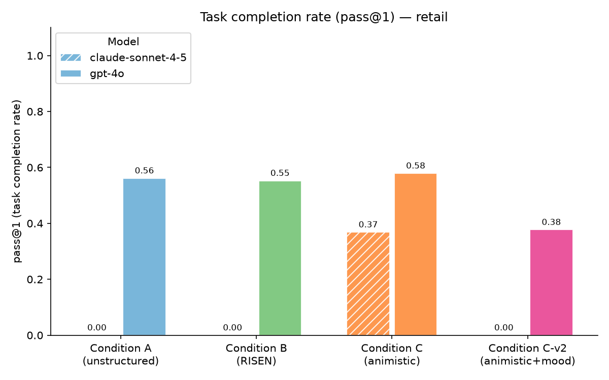

# Preliminary Results: Retail Domain, k=1, GPT-4o

> **Status**: Pilot results only. Single trial (k=1), retail domain, GPT-4o as agent and user simulator. Not sufficient for final conclusions — see [what's still needed](#whats-still-needed).

## Pass@1 Results

| Condition | Description | Pass@1 | DB Reward |
|---|---|---|---|
| A | Role-based, unstructured | 56.1% | 60.5% |
| B | Role-based, structured (RISEN) | 55.3% | 62.3% |
| C | Animistic (character sheet) | 53.5% | 60.5% |
| C-v2 | Animistic + mood/behavioral triggers | 53.5% | 60.5% |

114 tasks, 1 trial each. All conditions run with GPT-4o as agent and user simulator.

## Key Findings

### 1. No significant difference between conditions on pass@1

All four conditions cluster within 3 percentage points (53.5–56.1%). At this sample size and trial count, this is within noise. The null result on raw task completion is informative but not conclusive — the study hypotheses predict animistic framing shows advantages in consistency (pass^k) and scope adherence, not necessarily raw pass@1.

### 2. Task failure patterns differ by condition

While overall rates are similar, *which* tasks fail varies meaningfully:

- **24 tasks fail across all conditions** — these are benchmark hard cases that no prompt framing can fix (complex multi-order returns, ambiguous exchange chains)
- **30 tasks pass across all conditions** — straightforward tasks where framing is irrelevant
- **60 tasks have mixed outcomes** — the set where prompt framing actually matters

Of those 60 mixed tasks, conditions A and B have fewer unique failures than C and C-v2, suggesting the animistic framing may be too restrictive in ways that hurt on standard exchange and return tasks.

### 3. The mood/behavioral triggers (C-v2) did not improve over C

C-v2 added explicit behavioral trigger language derived from the character sheet mood grid (particularly a "stop and collect all items" trigger before one-shot exchange calls). C-v2 performed identically to C on pass@1 and DB reward, and failed 14 tasks that C passed while passing 14 tasks that C failed — a lateral shift, not an improvement.

Analysis of C-v2 failures suggests the "pause before one-shot operations" trigger caused the agent to over-confirm during multi-turn exchanges, losing track of agreed items and either choosing wrong variants or giving up and deferring to human agents unnecessarily.

### 4. RISEN (B) has the best DB reward

Condition B scores 62.3% on DB reward vs 60.5% for the others, suggesting the structured step sequence in RISEN produces better policy adherence even if pass@1 is similar. The explicit "confirm before executing" step in RISEN appears to reduce state errors more reliably than the animistic "what I protect" framing does.

## Failure Taxonomy (Animistic-specific)

The animistic prompt's "do not give product recommendations" rule is being over-applied. On exchange tasks that require browsing product options to find a valid replacement, the agent refuses or hedges when it should be looking up catalog options. This is a prompt design issue, not a framing issue — the rule needs to distinguish between "don't recommend" (opinions) and "don't look up" (factual catalog queries).

## What's Still Needed

- [ ] Clean k=1 run for conditions A and B with matched user simulator (current A/B runs used an older tau2 default user model)
- [ ] k=5 runs for pass^k consistency metric — the primary differentiator predicted by the animistic framing hypothesis
- [ ] Airline domain runs for both conditions
- [ ] Claude Sonnet as agent model (cross-model generalizability)
- [ ] Revised C-v2 prompt with softened trigger language
- [ ] Qualitative failure attribution study

## Run Details

| File | Condition | Tasks | Notes |
|---|---|---|---|
| `retail_conda_gpt_4o_k1_2026-06-29_1643.json` | A | 114 | Clean |
| `retail_condb_gpt_4o_k1_2026-06-29_1651.json` | B | 114 | Clean |
| `retail_condc_gpt_4o_u_gpt_4o_k1_2026-06-30_1753.json` | C | 114 | Clean |
| `retail_condcv2_gpt_4o_u_gpt_4o_k1_2026-06-30_1739.json` | C-v2 | 114 | Clean |

Several earlier runs were discarded due to OpenAI quota exhaustion mid-run (tasks recorded with empty message traces).
